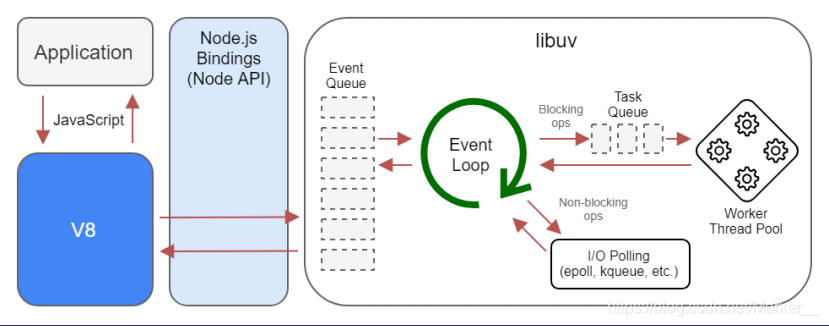
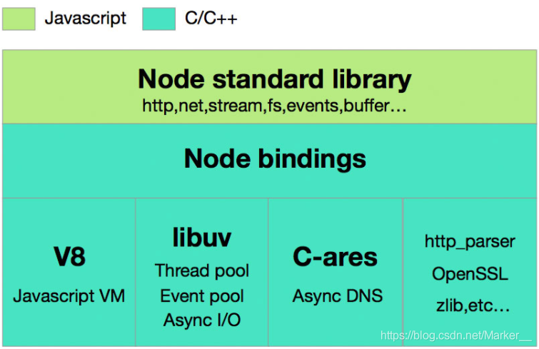
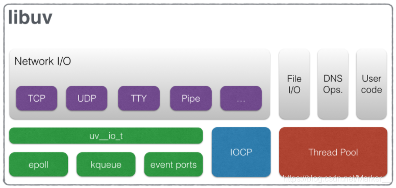
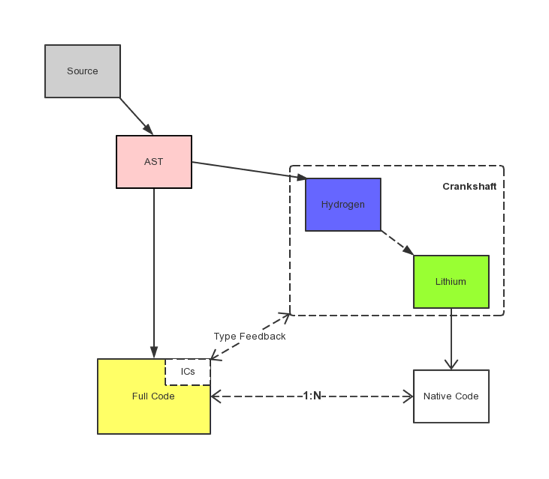
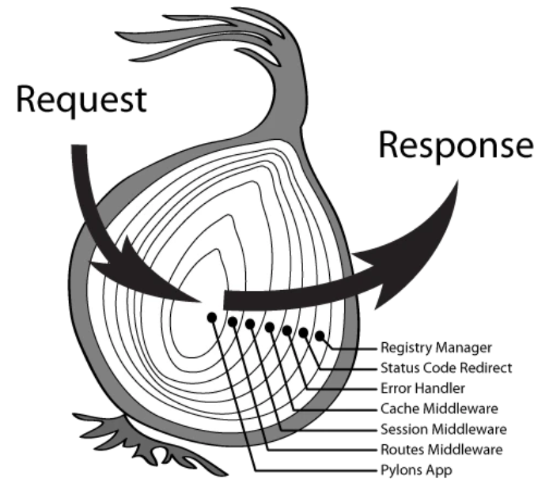
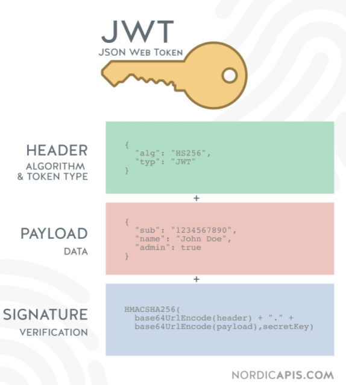

# Node.js 知识点

- [Node.js 知识点](#nodejs-知识点)
  - [Node.js 简介](#nodejs-简介)
  - [Node.js 的基本结构](#nodejs-的基本结构)
  - [Node Bindings 介绍](#node-bindings-介绍)
  - [libuv 介绍](#libuv-介绍)
  - [V8 引擎介绍](#v8-引擎介绍)
  - [Node.js 特点](#nodejs-特点)
    - [1. 事件驱动](#1-事件驱动)
    - [2. 回调函数](#2-回调函数)
    - [3. 单线程](#3-单线程)
    - [4. 非阻塞 I/O](#4-非阻塞-io)
  - [Node.js 的弊端(单线程带来的弊端)](#nodejs-的弊端单线程带来的弊端)
    - [无法利用多核 CPU](#无法利用多核-cpu)
    - [错误会引起整个应用退出无法继续调用异步 I/O](#错误会引起整个应用退出无法继续调用异步-io)
    - [大量计算占用 CPU 导致无法继续调用异步 I/O](#大量计算占用-cpu-导致无法继续调用异步-io)
  - [Node.js 的应用场景](#nodejs-的应用场景)
    - [Web 应用程序：](#web-应用程序)
    - [实时应用程序：](#实时应用程序)
    - [单页面应用（SPA）服务器：](#单页面应用spa服务器)
    - [数据流应用程序：](#数据流应用程序)
    - [工具和构建系统：](#工具和构建系统)
    - [微服务和中间件：](#微服务和中间件)
    - [物联网（IoT）应用：](#物联网iot应用)
    - [命令行工具：](#命令行工具)
  - [Node.js 事件循环](#nodejs-事件循环)
  - [Node.js 有哪些全局对象](#nodejs-有哪些全局对象)
  - [process 的常用属性和方法](#process-的常用属性和方法)
  - [fs 模块的常见用法](#fs-模块的常见用法)
  - [Buffer 的理解](#buffer-的理解)
  - [Stream 的理解](#stream-的理解)
  - [readFile 和 createReadStream 函数有什么区别](#readfile-和-createreadstream-函数有什么区别)
  - [EventEmitter 的理解](#eventemitter-的理解)
  - [如何处理 Node.js 中未捕获的异常](#如何处理-nodejs-中未捕获的异常)
  - [pnpm 与 npm/yarn 的区别及使用](#pnpm-与-npmyarn-的区别及使用)
  - [koa 中间件原理](#koa-中间件原理)
  - [jwt 鉴权](#jwt-鉴权)
    - [流程](#流程)
    - [Token 构成](#token-构成)
    - [优缺点](#优缺点)
  - [如何处理文件上传](#如何处理文件上传)
  - [Node.js 性能检测工具](#nodejs-性能检测工具)
  - [Node.js 性能优化方式](#nodejs-性能优化方式)
  - [什么是错误优先的回调函数](#什么是错误优先的回调函数)
  - [什么是测试金字塔](#什么是测试金字塔)
  - [单线程与多线程网络后端相比有哪些好处](#单线程与多线程网络后端相比有哪些好处)

---

## Node.js 简介

Node.js 给 JavaScript 提供了一个平台，让 JavaScript 可以调用一些 C/C++ 的接口，这大大扩展了 JavaScript 的能力，进而使 JavaScript 有了后端开发的能力。

以下是 node 的工作流程图。


## Node.js 的基本结构

Node.js 主要有 Node Standard Library、Node Bindings、V8、Libuv 四部分，架构图如下：



- Node Standard Library 是 Node 专门提供给开发人员使用的标准库，如 Http，fs 等模块。
- Node Bindings 是沟通 JS 和 C++ 的桥梁，封装 V8 引擎 和 Libuv 的细节，向上层提供基础 API 服务。
- 第三层是支撑 Node.js 运行的关键，由 C/C++ 实现。
  - V8 是 Google 开发的 JavaScript 引擎，提供 JavaScript 运行环境，可以说它就是 Node.js 的发动机。
  - Libuv 是专门为 Node.js 开发的一个封装库，提供跨平台的异步 I/O 能力.
  - C-ares：提供了异步处理 DNS 相关的能力。
  - http_parser、OpenSSL、zlib 等：提供包括 http 解析、SSL、数据压缩等其他的能力。

## Node Bindings 介绍

Node Bindings 是沟通 JS 和 C++ 的桥梁，封装 V8 引擎 和 Libuv 的细节，向上层提供基础 API 服务。

举个例子：C/C++ 实现了一个 http_parser 的库，非常高效，但是前端开发人员只会写 JavaScript，直接调用这个库肯定是不能成功的，所以就需要一个中间的桥梁。于是 Node.js 的作者就用 C++ 对 http_parser 库进行封装，使它符合某些要求（比如统一数据类型等），封装的文件叫做 http_parser_bindings.cpp。同时 Node.js 提供的编译工具可以将其编译为.node 文件。这样 JavaScript 代码可以直接 require 这个 .node 文件，这样 JavaScript 就能调用 C++ 库。

中间的桥梁就是 binding，由于 Node.js 提供了很多 binding，多个 binding 就构成了 Node 基本架构中的 Node bindings 了。有了这个 Node Bindings 后，JavaScript 和 C++ 就可以进行一些相互调用的操作，进而实现功能上的一些通信。这里有官网提供的示例，便于大家理解 JS 和 C++ 是如何进行通信的：JS 调用 C++ 代码、C++ 调用 JS 回调。

> ps：除了 Node.js 提供的这些 Bindings 之外，还支持开发人员自定义封装 C/C++ 来扩展你想要实现的功能。

## libuv 介绍

Node.js 最早时是使用了 Google 的 V8 解析引擎 和 Marc Lehmann 的 libev。Node.js 将事件驱动的 I/O 模型与适合该模型的编程语言（JavaScript）融合在了一起，但随着 Node.js 的日益流行，Node.js 也需要同时支持 Windows，但是 libev 只能在 Unix 环境下运行，而在 Windows 系统平台上与 kqueue(FreeBSD) 或者 (e)poll(Linux) 等内核事件通知相应的机制是 IOCP。

基于上述背景，Node.js 之父 Ryan 就着手开发了一个 跨平台的异步 I/O 库，将上述操作系统对应的库都整合到一起，于是乎就诞生了 libuv，libuv 会根据不同的操作系统自动选择合适的方案，它的所有功能都是异步的，一般是用于 操作 TCP/UDP/DNS/文件等的异步操作。

为啥是异步？因为即便是 SSD 的访问相较于高速的 CPU，仍然是慢速设备。于是基于 事件驱动 的 IO 模型就应运而生，解决了高速设备同步等待慢速设备或访问的问题。这不是 libuv 的独创，linux kernel 原生支持的 NIO 也是这个思路。 但 libuv 统一了网络访问，文件访问，做到了跨平台。



上述 libuv 的架构图中，从左往右分为两部分，一部分是与网络 I/O 相关的请求，而另外一部分是由文件 I/O, DNS Ops 以及 User code 组成的请求。

从图中可以看出，对于 Network I/O 和以 File I/O 为代表的另一类请求，异步处理的底层支撑机制是完全不一样的。对于 Network I/O 相关的请求， 根据 OS 平台不同，分别使用 Linux 上的 epoll，OSX 和 BSD 类 OS 上 的 kqueue，SunOS 上的 event ports 以及 Windows 上的 IOCP 机制。而对于 File I/O 为代表的请求，则使用 thread pool。利用 thread pool 的方式实现异步请求处理，在各类 OS 上都能获得很好的支持。

## V8 引擎介绍

V8 是目前商用的执行 JavaScript 最快的一个引擎，它的功能有很多：将 JavaScript 源代码变成本地代码并执行、维护 JavaScript 的调用栈，确保 JavaScript 函数的执行顺序、负责内存管理，为所有对象分配内存、垃圾回收，重复利用无用的内存、实现 JS 的标准库。



现在 JS 引擎的执行过程大致是：源代码 --->抽象语法树 --->字节码 --->JIT--->本地代码。

V8 更加直接的将抽象语法树通过 JIT 技术转换成本地代码，放弃了在字节码阶段可以进行的一些性能优化，但保证了执行速度。 在 V8 生成本地代码后，也会通过 Profiler 采集一些信息，来优化本地代码。虽然，少了生成字节码这一阶段的性能优化， 但极大减少了转换时间。

这里有几个注意的点：V8 是不提供 DOM API 的，那是浏览器所提供的、V8 本身是包含多个线程的，但它执行 JS 的过程是单线程的、V8 自己自带了 Eventloop，但是 Node.js 基于 libuv 自己做了一个。

## Node.js 特点

Node.js 是异步的、事件驱动的、非阻塞的和单线程的，使得它成为开发下面应用程序的完美候选：

- 实时应用程序：如聊天和提供实时更新的应用程序
- 将视频或其他多媒体内容流式传输给大量观众的流式应用程序
- 其他 I/O 密集型应用程序，如协作平台
- 遵循微服务架构的网络后端

然而，Node.js 的特性使得它对于其他类型的应用程序来说不是一个理想的选择。执行 CPU 密集型任务的应用程序（如复杂的数学计算）在使用 CPU 时表现不佳，因为 Node.js 是单线程的。

### 1. 事件驱动

Node.js 是基于事件驱动的模型。它使用事件循环（event loop）来处理异步操作。当某个异步操作完成时，Node.js 会触发相应的事件，然后执行注册在该事件上的回调函数。

### 2. 回调函数

在 Node.js 中，你通常会传递一个回调函数作为参数给异步操作，该回调函数将在操作完成时被调用。这样，在等待 I/O 操作的同时，你可以继续执行其他任务，而不必阻塞整个程序。

### 3. 单线程

Node.js 是单线程的，但它通过事件循环实现了并发。虽然 JavaScript 代码在一个线程中执行，但由于 I/O 操作是异步的，事件循环可以在等待 I/O 完成的同时继续处理其他任务。

### 4. 非阻塞 I/O

当进行 I/O 操作时，Node.js 不会等待操作完成再执行下一个任务，而是会注册一个回调函数，然后继续执行后续代码。当 I/O 操作完成时，事件循环将调用相应的回调函数，处理操作的结果。

## Node.js 的弊端(单线程带来的弊端)

Node.js 中有一个特点就是单线程，它带来了很多好处，但是它也有弊端，单线程弱点如下。

### 无法利用多核 CPU

1.  使用 cluster 模块：创建子进程，每个子进程都运行在一个独立的 CPU 核心上
2.  使用 Worker Threads：在单个进程内创建多个线程，以便更好地利用多核 CPU
3.  使用 第三方模块 pm2

### 错误会引起整个应用退出无法继续调用异步 I/O

1.  使用 try-catch 捕获错误
2.  监听 uncaughtException 事件

### 大量计算占用 CPU 导致无法继续调用异步 I/O

1.  使用 Worker Threads 创建子线程
2.  使用异步任务队列
3.  使用 child_process/cluster 创建子进程处理计算密集型任务
4.  如果无法将任务进行拆分，则无解

## Node.js 的应用场景

Node.js 是一个灵活的服务器端 JavaScript 运行时环境，它在各种应用场景中都能发挥作用。以下是一些常见的 Node.js 应用场景分类：

### Web 应用程序：

**后端服务：** Node.js 适用于构建高性能的后端服务，处理并发请求，如用户认证、数据存储和检索等。
**RESTful API：** Node.js 可以轻松构建 RESTful API，快速响应客户端请求。

### 实时应用程序：

**即时通讯：** 使用 WebSocket 或 Socket.io 等库，Node.js 可以构建实时通讯应用，如聊天应用或在线游戏。
**实时协作工具：** 用于构建实时协作平台，支持多用户同时编辑和查看数据。

### 单页面应用（SPA）服务器：

**服务端渲染（SSR）：** Node.js 可以用于实现服务器端渲染，提高首次加载性能，对于支持 SEO 的 SPA 应用很有用。

### 数据流应用程序：

**文件上传和处理：** 处理大文件上传，同时进行数据处理，如图片压缩、文件存储等。
**实时数据处理：** 使用流式处理数据，如日志分析、实时监控等。

### 工具和构建系统：

**自动化构建：** 使用 Node.js 可以构建自动化的构建工具，如 Grunt、Gulp 等。
**包管理器：** Node.js 的 npm 是一个强大的包管理器，用于管理项目依赖项。

### 微服务和中间件：

**微服务架构：** Node.js 适用于构建轻量级的、可扩展的微服务，支持分布式系统。
**中间件：** 作为中间层处理请求和响应，执行一些通用的逻辑，如身份验证、日志记录、缓存等。

### 物联网（IoT）应用：

**传感器数据处理：** 处理物联网设备生成的传感器数据，进行实时分析和响应。
**远程控制：** 通过 WebSocket 等实现远程控制和监控。

### 命令行工具：

**脚本：** Node.js 提供了强大的脚本能力，适用于构建命令行工具和任务自动化。
**CLI 应用：** 构建自定义的命令行应用程序。

这只是 Node.js 应用场景的一小部分，Node.js 的轻量、高效、非阻塞的特性使得它在各种不同的领域都有应用价值。选择 Node.js 还取决于开发团队的技能和项目的需求。

## Node.js 事件循环

- https://juejin.cn/post/7010308647792148511
- https://juejin.cn/post/6844904100195205133

## Node.js 有哪些全局对象

- 真正的全局对象
  - Class
  - Buffer
  - process
  - console
  - clearInterval、setInterval
  - clearTimeout、setTimeout
  - global
- 模块级别的全局变量

  这些全局对象是模块中的变量，只是每个模块都有，看起来就像全局变量，像在命令交互中是不可以使用，包括：

  - \_\_dirname
  - \_\_filename
  - exports
  - module
  - require

## process 的常用属性和方法

- process.env：环境变量，例如通过 `process.env.NODE_ENV 获取不同环境项目配置信息
- process.nextTick：这个在谈及 EventLoop 时经常为会提到
- 进程事件： process.on('uncaughtException',cb) 捕获异常信息、 process.on('exit',cb）进程推出监听
- process.pid：获取当前进程 id

## fs 模块的常见用法

- readFile
- readFileSync
- writeFile
- writeFileSync
- appendFile
- appendFileSync
- copyFile
- copyFileSync
- mkdir
- mkdirSync

## Buffer 的理解

创建 Buffer 的方法有很多种，下面是两种常见的形式：

- Buffer.from()

```js
const b1 = Buffer.from("10");
const b2 = Buffer.from("10", "utf8");
const b3 = Buffer.from([10]);
const b4 = Buffer.from(b3);

console.log(b1, b2, b3, b4); // <Buffer 31 30> <Buffer 31 30> <Buffer 0a> <Buffer 0a>
```

- Buffer.alloc()

```js
const bAlloc1 = Buffer.alloc(10); // 创建一个大小为 10 个字节的缓冲区
const bAlloc2 = Buffer.alloc(10, 1); // 建一个长度为 10 的 Buffer,其中全部填充了值为 `1` 的字节
console.log(bAlloc1); // <Buffer 00 00 00 00 00 00 00 00 00 00>
console.log(bAlloc2); // <Buffer 01 01 01 01 01 01 01 01 01 01>
```

所支持的字符集有如下：

- ascii：仅支持 7 位 ASCII 数据，如果设置去掉高位的话，这种编码是非常快的
- utf8：多字节编码的 Unicode 字符，许多网页和其他文档格式都使用 UTF-8
- utf16le：2 或 4 个字节，小字节序编码的 Unicode 字符，支持代理对（U+10000 至 U+10FFFF）
- ucs2: utf16le 的别名
- base64：Base64 编码
- latin：一种把 Buffer 编码成一字节编码的字符串的方式
- binary：latin1 的别名，
- hex：将每个字节编码为两个十六进制字符

## Stream 的理解

source -> pipe -> dest

- https://vue3js.cn/interview/NodeJS/Stream.html#%E4%B8%89%E3%80%81%E5%BA%94%E7%94%A8%E5%9C%BA%E6%99%AF

## readFile 和 createReadStream 函数有什么区别

readFile 函数异步读取文件的全部内容，并存储在内存中，然后再传递给用户。

createReadStream 使用一个可读的流，逐块读取文件，而不是全部存储在内存中。

与 readFile 相比，createReadStream 使用更少的内存和更快的速度来优化文件读取操作。如果文件相当大，用户不必等待很长时间直到读取整个内容，因为读取时会先向用户发送小块内容。

## EventEmitter 的理解

Node 的 events 模块只提供了一个 EventEmitter 类，这个类实现了 Node 异步事件驱动架构的基本模式——观察者模式

```js
const EventEmitter = require("events");

class MyEmitter extends EventEmitter {}
const myEmitter = new MyEmitter();

function callback() {
  console.log("触发了event事件！");
}
myEmitter.on("event", callback);
myEmitter.emit("event");
myEmitter.removeListener("event", callback);
```

## 如何处理 Node.js 中未捕获的异常

```js
process.on("uncaughtException", (err) => {
  console.log("exception caught: ", err);
});
```

## pnpm 与 npm/yarn 的区别及使用

- https://juejin.cn/post/7095645259677302815

## koa 中间件原理

Koa 中间件采用的是洋葱圈模型，每次执行下一个中间件传入两个参数：

- ctx ：封装了 request 和 response 的变量
- next ：进入下一个要执行的中间件的函数



**Token 校验**

```js
module.exports = (options) => async (ctx, next) {
  try {
    // 获取 token
    const token = ctx.header.authorization
    if (token) {
      try {
          // verify 函数验证 token，并获取用户相关信息
          await verify(token)
      } catch (err) {
        console.log(err)
      }
    }
    // 进入下一个中间件
    await next()
  } catch (err) {
    console.log(err)
  }
}
```

## jwt 鉴权

### 流程

在目前前后端分离的开发过程中，使用 token 鉴权机制用于身份验证是最常见的方案，流程如下：

1. 服务器验证用户登录的账号和密码是否正确
2. 验证通过后，给用户颁发一个令牌，这个令牌作为后续用户访问一些接口的凭证
3. 后续访问会根据这个令牌判断用户时候有权限进行访问

### Token 构成

Token，分成了三部分，头部（Header）、载荷（Payload）、签名（Signature），并以.进行拼接。其中头部和载荷都是以 JSON 格式存放数据，只是进行了 base64 编码



### 优缺点

**优点**

- json 具有通用性，所以可以跨语言
- 组成简单，字节占用小，便于传输
- 服务端无需保存会话信息，很容易进行水平扩展
- 一处生成，多处使用，可以在分布式系统中，解决单点登录问题
- 可防护 CSRF 攻击

**缺点**

- 不适用于存储敏感信息： JWT 虽然可以加密，但不适合用于存储敏感信息，因为它是可解码的。如果需要存储敏感信息，应该使用 JWE（JSON Web Encryption）。
- 无法撤销： 一旦 JWT 被签发，除非到期时间过期，否则无法撤销。这意味着在某些情况下，无法即时地使令牌失效，需要等到过期。

## 如何处理文件上传

- 设置请求头为 Content-Type: multipart/form-data

有两种方式解析上传的文件

1. koa-body

```js
const koaBody = require("koa-body");
app.use(
  koaBody({
    multipart: true,
    formidable: {
      maxFileSize: 200 * 1024 * 1024, // 设置上传文件大小最大限制，默认2M
    },
  })
);

router.post("/uploadfile", async (ctx, next) => {
  // 上传单个文件
  const file = ctx.request.files.file; // 获取上传文件
  // 创建可读流
  const reader = fs.createReadStream(file.path);
  let filePath = path.join(__dirname, "public/upload/") + `/${file.name}`;
  // 创建可写流
  const upStream = fs.createWriteStream(filePath);
  // 可读流通过管道写入可写流
  reader.pipe(upStream);
  return (ctx.body = "上传成功！");
});
```

2. koa-multer

```js
const storage = multer.diskStorage({
  destination: (req, file, cb) => {
    cb(null, "./upload/");
  },
  filename: (req, file, cb) => {
    cb(null, Date.now() + path.extname(file.originalname));
  },
});

const upload = multer({
  storage,
});

const fileRouter = new Router();

fileRouter.post("/upload", upload.single("file"), (ctx, next) => {
  console.log(ctx.req.file); // 获取文件
});

app.use(fileRouter.routes());
```

## Node.js 性能检测工具

- easy-monitor

## Node.js 性能优化方式

- 使用最新版本 Node.js
- 正确使用流 Stream
- 代码层面优化
  - 避免同步阻塞调用，使用异步 API。
  - 避免不必要的全局变量。
  - 使用本地变量以提高访问速度。
  - 尽量减小函数的调用栈深度。
- 使用缓存
  - 缓存频繁访问的数据，减少对数据库或其他外部资源的请求。
  - 使用内存缓存，如 redis，加速数据的读取。
- 适当的并发处理：
  - 使用 Node.js 的 Cluster 模块或进程池，充分利用多核 CPU。
  - 使用负载均衡，如 Nginx，分发请求到不同的 Node.js 实例。
- 监控和分析
  - easy-monitor

## 什么是错误优先的回调函数

错误优先的回调函数用于传递错误和数据。第一个参数始终应该是一个错误对象， 用于检查程序是否发生了错误。其余的参数用于传递数据。例如：

```js
fs.readFile(filePath, function (err, data) {
  if (err) {
    //handle the error
  }
  // use the data object
});
```

## 什么是测试金字塔

测试金字塔指的是： 当我们在编写测试用例时，底层的单元测试应该远比上层的端到端测试要多。

## 单线程与多线程网络后端相比有哪些好处

- **单线程（如 Node.js）**
  - 简单易用： 单线程模型相对简单，易于理解和维护。
  - 事件驱动： 单线程采用事件驱动的方式，避免了线程切换的开销，提高了响应速度。
  - 节约资源： 不需要为每个连接创建新的线程，节约了系统资源，适用于高并发场景。
  - 避免锁竞争： 无需担心线程之间的锁竞争问题，避免了复杂的同步和死锁的风险。
- **多线程**
  - 并行处理： 多线程可以利用多核 CPU 并行处理任务，提高整体性能。
  - 适用于计算密集型任务： 适合处理需要大量计算的任务，因为可以将计算分配给不同的线程。
  - 稳定性： 单个线程崩溃不会导致整个应用崩溃，提高了系统的稳定性。
- **共同优势**
  - 异步 I/O： 单线程和多线程都可以使用异步 I/O，提高了处理大量并发请求的能力。
  - 灵活性： 两者都可以通过合理的设计和架构来提高系统的灵活性。
- **综合比较**
  - 单线程优势： 简单、轻量、高并发、事件驱动。
  - 多线程优势： 多核利用、计算密集型任务、稳定性。

选择单线程或多线程取决于具体的应用需求。对于 I/O 密集型任务，单线程通常更适合，而对于计算密集型任务，多线程可能更合适。在实际应用中，可以根据业务场景和性能需求进行权衡和选择。
